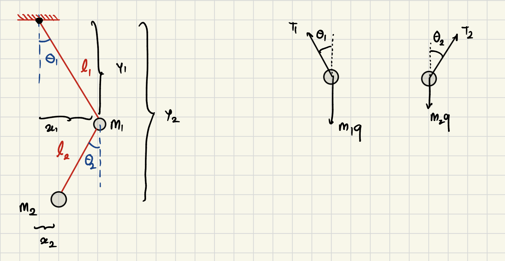

# Double Pendulum (Raylib)

This is a double pendulum simulation. Small angles behave almost like a linear system; large angles are nonlinear and chaotic.


## Controls

Press **Space** to restart with a new random start.

## Build and Run

```sh
make
./main
```

Or:

```sh
make run
```

## Parameters

Edit the parameters in `main.c`:

1. `L1`, `L2`, `g` are constants.
2. `m1`, `m2`, and the initial angles are set in `init_solver()`.

## Math

Assumptions: the rods are massless and rigid, and the masses are point masses. Below is a direct Newtonian derivation of the equations of motion.

### Kinematics of the Double Pendulum

Kinematics describes position, velocity, and acceleration without considering forces.



## Setup

Place the origin at the fixed pivot. Angles $\theta_1, \theta_2$ are measured from vertical (counter-clockwise positive). $T_1, T_2$ are rod tensions.

**Positions:**

$$x_1 = L_1\sin\theta_1, \qquad y_1 = -L_1\cos\theta_1$$

$$x_2 = x_1 + L_2\sin\theta_2, \qquad y_2 = y_1 - L_2\cos\theta_2$$


## Accelerations

Differentiating positions twice:

$$\ddot{x}_1 = -\dot\theta_1^2 L_1\sin\theta_1 + \ddot\theta_1 L_1\cos\theta_1 \tag{1}$$

$$\ddot{y}_1 = \dot\theta_1^2 L_1\cos\theta_1 + \ddot\theta_1 L_1\sin\theta_1 \tag{2}$$

$$\ddot{x}_2 = \ddot{x}_1 - \dot\theta_2^2 L_2\sin\theta_2 + \ddot\theta_2 L_2\cos\theta_2 \tag{3}$$

$$\ddot{y}_2 = \ddot{y}_1 + \dot\theta_2^2 L_2\cos\theta_2 + \ddot\theta_2 L_2\sin\theta_2 \tag{4}$$


## Forces

**Upper mass $m_1$** — acted on by $T_1$ (upper rod), $T_2$ (lower rod), and gravity:

$$m_1\ddot{x}_1 = -T_1\sin\theta_1 + T_2\sin\theta_2 \tag{5}$$

$$m_1\ddot{y}_1 = T_1\cos\theta_1 - T_2\cos\theta_2 - m_1 g \tag{6}$$

**Lower mass $m_2$** — acted on by $T_2$ and gravity only:

$$m_2\ddot{x}_2 = -T_2\sin\theta_2 \tag{7}$$

$$m_2\ddot{y}_2 = T_2\cos\theta_2 - m_2 g \tag{8}$$


## Eliminating Tensions

From (7) and (8): $T_2\sin\theta_2 = -m_2\ddot{x}_2$ and $T_2\cos\theta_2 = m_2\ddot{y}_2 + m_2 g$.

Substituting into (5) and (6):

$$m_1\ddot{x}_1 = -T_1\sin\theta_1 - m_2\ddot{x}_2 \tag{9}$$

$$m_1\ddot{y}_1 = T_1\cos\theta_1 - m_2\ddot{y}_2 - (m_1+m_2)g \tag{10}$$

To eliminate $T_1$, multiply (9) by $\cos\theta_1$ and (10) by $\sin\theta_1$. Both give the same left-hand side $T_1\sin\theta_1\cos\theta_1$, so setting them equal:

$$\sin\theta_1\bigl(m_1\ddot{y}_1 + m_2\ddot{y}_2 + (m_1+m_2)g\bigr) = -\cos\theta_1\bigl(m_1\ddot{x}_1 + m_2\ddot{x}_2\bigr) \tag{11}$$

Similarly from (7) and (8), multiply by $\cos\theta_2$ and $\sin\theta_2$ and set equal:

$$\sin\theta_2\bigl(m_2\ddot{y}_2 + m_2 g\bigr) = -\cos\theta_2\bigl(m_2\ddot{x}_2\bigr) \tag{12}$$


## Substituting Accelerations

Plug equations (1–4) into (11) and (12). Using the identity $\sin A\cos B - \cos A\sin B = \sin(A-B)$, cross terms combine. Let $\Delta = \theta_1 - \theta_2$.

**From (12):**

$$\ddot\theta_2\, L_2 + \ddot\theta_1\, L_1\cos\Delta + \dot\theta_1^2 L_1\sin\Delta + g\sin\theta_2 = 0 \tag{13}$$

**From (11):**

$$(m_1+m_2)\ddot\theta_1\, L_1 + m_2\ddot\theta_2\, L_2\cos\Delta - m_2\dot\theta_2^2 L_2\sin\Delta + (m_1+m_2)g\sin\theta_1 = 0 \tag{14}$$


## Solving the 2×2 System

Rewrite as a matrix equation:

$$\begin{pmatrix}(m_1+m_2)L_1 & m_2 L_2\cos\Delta \\ L_1\cos\Delta & L_2\end{pmatrix}\begin{pmatrix}\ddot\theta_1\\\ddot\theta_2\end{pmatrix} = \begin{pmatrix}m_2 L_2\dot\theta_2^2\sin\Delta - (m_1+m_2)g\sin\theta_1 \\ -L_1\dot\theta_1^2\sin\Delta - g\sin\theta_2\end{pmatrix}$$

Applying Cramer's rule. The determinant simplifies using $\cos(2\Delta) = 2\cos^2\Delta - 1$, giving a shared denominator:

$$D = 2m_1 + m_2 - m_2\cos(2\Delta)$$


## Equations of Motion

$$\ddot\theta_1 = \frac{-g(2m_1+m_2)\sin\theta_1\ -\ m_2 g\sin(\theta_1-2\theta_2)\ -\ 2\sin\Delta\cdot m_2\bigl(\dot\theta_2^2 L_2 + \dot\theta_1^2 L_1\cos\Delta\bigr)}{L_1\cdot D}$$

$$\ddot\theta_2 = \frac{2\sin\Delta\bigl(\dot\theta_1^2 L_1(m_1+m_2)\ +\ g(m_1+m_2)\cos\theta_1\ +\ \dot\theta_2^2 L_2 m_2\cos\Delta\bigr)}{L_2\cdot D}$$

where $\Delta = \theta_1 - \theta_2$ and $D = 2m_1 + m_2 - m_2\cos(2\Delta)$.

A big thanks to the resources made available from MIT (https://www.myphysicslab.com/pendulum/double-pendulum-en.html) and Claude for helping me solve the very horrible 2x2 matrix to get the required equations for the motion of the pendulum.